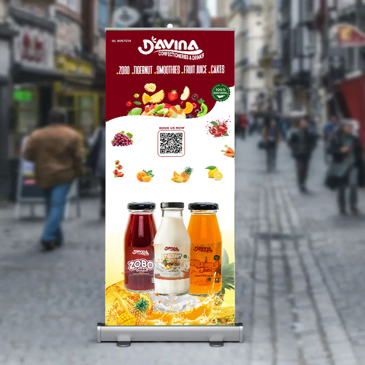

## ABOUT ME

I’m a creative professional with a strong eye for detail and a passion for building clean, and impactful visual experiences. I specialize in branding, design refinement, imagery art with a focus on delivering high-quality results that communicate clearly and stand out. I’m driven by continuous improvement, collaboration, and turning ideas into polished outcomes that meet both creative and business goals.

## WHAT I DO

As a graphic designer, photographer, and a person who is into branding. I create clean, consistent, and visually impactful identities that communicate clearly, connect with audiences, and elevate brands professionally.

*- ✅Graphic Design*

I create clean, visually compelling designs that communicate ideas clearly, strengthen brand identity, and deliver professional results across digital and print platforms.

*- ✅Photography*

I create striking visuals through photography and art, capturing light, detail, and emotion to tell compelling stories and elevate brands.

*- ✅Branding*

I build cohesive brand identities by combining strategy, design, and consistency to help brands stand out, connect with their audience, and grow with confidence

## MY PROJECTS

A glimpse of some of the projects I have worked on.

**BRANDING**

 (WhatsApp Image 2026-01-18 at 3.13.59 PM.jpeg)

*Analysis of a six-month coffee sales transaction dataset.*

I explored sales performance by product category and type, tracked revenue across different store locations, and analyzed how transaction volume changed by day and month.

[Read More](https://www.linkedin.com/posts/ogungbe-ebunoluwa_ebunonamission-dataanalytics-learningjourney-activity-7407728933212794880-loaU/)

## CONTACT DETAILS

📧 ebunoluwaogungbe@gmail.com

📍 Lagos, Nigeria

📃 <a href="Ebunoluwa CV.pdf"> Download my CV here (PDF file)</a>

🌐 <a href="https://www.linkedin.com/in/ogungbe-ebunoluwa/"> Check out my insightful LinkedIn posts</a>
